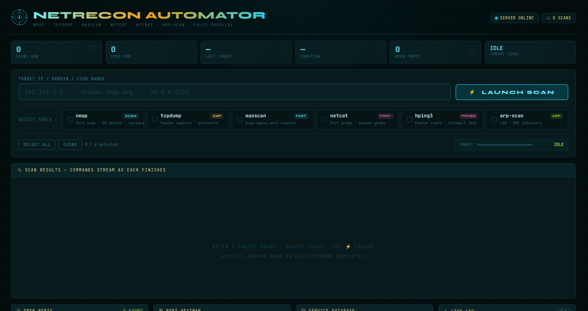
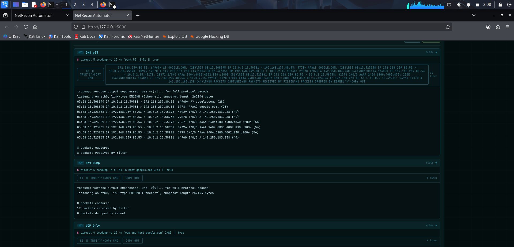

# Network Reconnaissance Automation

## Overview
A web-based interface for automating common network reconnaissance tools—specifically Nmap, TCPDump, Masscan, Netcat, hping3, and arp-scan—within a Kali Linux environment. It provides a functional system where a user can input a target (domain or IP), select desired tools and parameters, execute scans concurrently, view the results directly in the browser via Server-Sent Events (SSE), and download the outputs.

## Features
- **Concurrent Scanning**: Every tool command runs in its own thread to maximize efficiency and shorten reconnaissance time.
- **Server-Sent Events (SSE)**: Real-time scan updates and outputs stream directly to the web UI.
- **Support for Multiple Tools**: Pre-configured with heavily utilized modes of `nmap`, `tcpdump`, `masscan`, `netcat`, `hping3`, and `arp-scan`.
- **Downloadable Reports**: Export all or specific tool findings as `.txt` or `.json`.
- **Responsive Web UI**: Built with Flask and a custom CSS UI.

## Getting Started

### Prerequisites

You should run this tool on a system (like Kali Linux) that has the underlying CLI tools installed:
- `nmap`
- `tcpdump`
- `masscan`
- `netcat` (nc)
- `hping3`
- `arp-scan`

### Installation

1. Clone the repository:
   ```bash
   git clone https://github.com/bhavana26350/Network-Reconnaissance-Automation.git
   cd Network-Reconnaissance-Automation
   ```

2. Install Python dependencies:
   ```bash
   pip install -r requirements.txt
   ```

3. Run the application:
   ```bash
   sudo python3 recon_server.py
   ```
   > **Note:** Many underlying network tools (like nmap OS detection or masscan) require root privileges, so it is highly recommended to run the server with `sudo`.

4. Open your browser and navigate to:
   ```
   http://127.0.0.1:5000
   ```

## Usage
1. Enter a valid IPv4 address, domain, or subnet. 
2. Select the tools you wish to invoke.
3. Click "Start Complete Scan". Reports will stream to your interface.
4. You can use the specific tool tabs to review logs isolated by program, or download reports using the Download buttons.

## License
[MIT License](LICENSE)
"# Network-Reconnaissance-Automation" 




